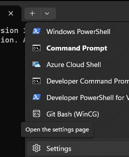
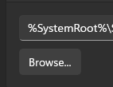

# Before you start (Required Software)

You will need to ensure one of the following combinations is installed:
- Microsoft Terminal and Git-SCM, or
- Microsoft Terminal and Laragon

## Microsoft Terminal Installation

This is a great way to interact with the command line.

Open the Microsoft Store, and search for "Microsoft Terminal".

Install the "Microsoft Terminal" version and not the preview.

## Git Installation

Easiest way is to download and use the Git SCM installer:

https://git-scm.com/download/win

Use the 64 Bit version when possible.

Run the installer and accept the defaults.

## Laragon Installation

Download the Full Installer from https://laragon.org/download/index.html.

Run the installer and accept the defaults.

This places Laragon in the folder `c:\Laragon`.

# The CLI

CLI stands for Command Line Interpreter.

There are many of them including:
- Windows Command Prompt
- Microsoft PowerShell
- bash 
- zshell
- and many more

## Parts of the Prompt

| Image                                              | Description |
|----------------------------------------------------| ---- |
|      | This is the user account, followed by the computer name and separated by an `@`  Literally: *User **at** Computer*   |
|      | Tells us that we are running in MinGW 64 bit   |
|  | Shows we are in the `~/Source/Repos` folder, where `~` is the user's (your) home folder.  In Windows terms, this is the same as:    `C:\Users\UserName\Source\Repos`   |

## Setting up Microsoft Terminal to use Git Bash as a CLI

Open MS Terminal.

Click on the `v`  (or press `CTRL`+`,`) on the tab bar.

Click *Settings*...

Click on *Add a new profile*...

Click *New Empty Profile*...

Click on the `v` next to the "*Profile x*"...

And give the profile a name...

Next find the *Command Line* entry and click on the `v`

Then click the *Browse* button...

At home, if you have installed using Git-SCM installer then the default location for Git is: `c:\program files\git`. If you have Laragon installed using the default installation location, then you should find Git in the `C:\Laragon\bin\git` folder.

> At TAFE, we have a different location, `c:\ProgramData\git` or even `C:\ProgramData\Laragon\bin\git`.

Use the browse to locate the folder and find either the `git.exe` or the `bash.exe` file in the `bin` folder.

Click on the Starting Directory `v` and then untick the "*Use parent process directory*"...

 
This should then show `%USERPROFILE%` in a text field and `Browse` button underneath... 

No matter what is shown, clear the content and enter the following in its place...

`%USERPROFILE%\Source\Repos`

Click `SAVE` to save the changes

### Visual flair (optional)
You may optionally customise the appearance of the terminal. 

Adrian tends to do this to visually identify the various prompts.

The steps below are optional, and you may vary to your own "taste".

Click the *Appearance* item.

You may change the base colour scheme, the font face and more.

Here are the settings Adrian has for this terminal prompt:

Click Save then you can click the `X` next to settings to close the dialog.

Finally you are able to open the new terminal by clicking on the `v` and selecting your custom terminal or using the short-cut it shows on the right next to your custom terminal.

You will now have your terminal open and ready:

